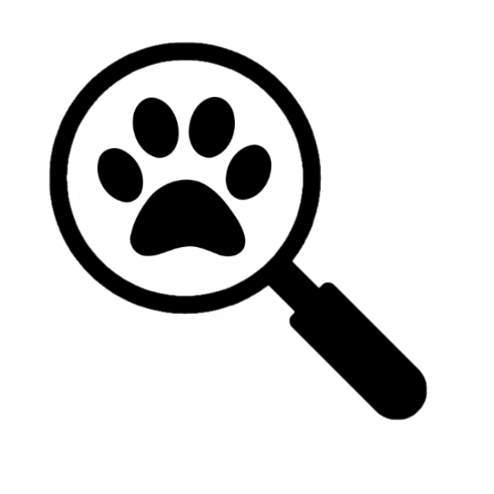

<!-- PROJECT LOGO -->
<br />
<p align="center">
  <a href="https://github.com/harrisonchiu/dogid-model">
    
  </a>

  <h1 align="center">DogID Machine Learning Model</h1>

  <h3 align="center">
    Convolutional neural network that identifies dog breeds and does object detection of images
    <br />
    <br />
    <a href="https://github.com/harrisonchiu/dogid-model">DogID App (Mobile App)</a>
    ·
    <a href="https://github.com/harrisonchiu/dogid-api">DogID API (Backend API)</a>
  </h3>
</p>


<!-- TABLE OF CONTENTS -->
<details open="open">
  <summary><h2 style="display: inline-block">Table of Contents</h2></summary>
  <ol>
    <li>
      <a href="#about-dogid-model">About DogID Model</a>
    </li>
    <li>
      <a href="#set-up-locally">Set Up Locally</a>
    </li>
    <li>
      <a href="#roadmap">Roadmap</a>
    </li>
    <li>
      <a href="#citation">Citation</a>
    </li>
  </ol>
</details>


<!-- ABOUT THE PROJECT -->
## About DogID Model

This repository contains the files to run, train, and build the
convolutional neural network model that identifies 130 different dog breeds.

It also contains the object detection model that identifies and draws boxes
around dogs in images.

This model is used in the [DogID App](https://github.com/harrisonchiu/dogid-app)
to identify dog breeds via the user's camera.

Go to the README in
[feature/breed-classifier-compare](https://github.com/harrisonchiu/dogid-model/tree/feature/breed-classifier-compare)
branch to see a summary list of our testing on different pretrained models and classification layers.

Model to detect dog objects in images is still work in progress.
See this branch: [feature/object-detector-a](https://github.com/harrisonchiu/dogid-model/tree/feature/object-detector-a)


<!-- GETTING STARTED -->
## Set Up Locally

To get a local copy up and running follow these simple steps,
assuming jupyter notebook and Python are installed.

1. Clone the repo
    ```sh
    git clone https://github.com/harrisonchiu/dogid-model.git && cd dogid-model
    ```
2. Install Python library requirements
    ```sh
    pip install -r requirements.txt
    ```
3. Run jupyter file
    ```sh
    jupyter notebook breed_classifier.ipynb
    ```


<!-- ROADMAP -->
## Roadmap
- [ ] Train EfficientNetV2-B3 with 30+? epochs. Train on colab because local GPU does not have enough ram.
    - Done only for 10 epochs so far with peak accuracy of 0.8235 // ~0.73
        - Validation accuracy seems to be the highest at 7th epoch with 0.7440
        - Could still vastly improve past 10 epochs?
- [ ] Train EfficientNetV2-S and EfficientNetV2-M. They perform well, but will need more ram.
- [ ] Train EfficientNetB6 and B7.
    - Larger input image size
        - But most training images are at B5 (~500x500 px) size, so likely little improvements?
- [x] Create and train own convolutional neural network.
  - [ ] Improve its accuracy to at least 75%
- [ ] Finish Object detector model that detects dogs in images and videos


## Citation

We used Tsinghua dog dataset.

```
@article{Zou2020ThuDogs,
  title={A new dataset of dog breed images and a benchmark for fine-grained classification},
  author={Zou, Ding-Nan and Zhang, Song-Hai and Mu, Tai-Jiang and Zhang, Min},
  journal={Computational Visual Media},
  year={2020},
  url={https://doi.org/10.1007/s41095-020-0184-6}
}
```